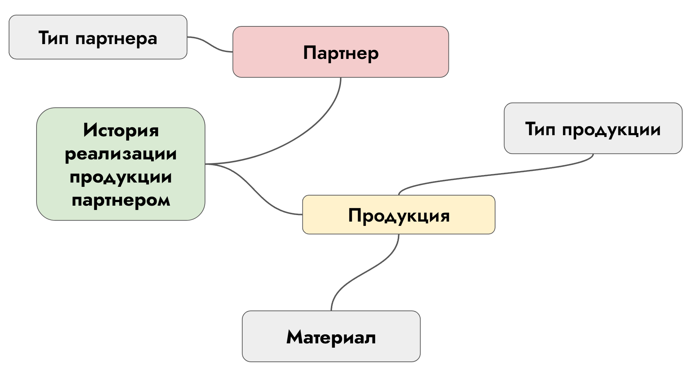
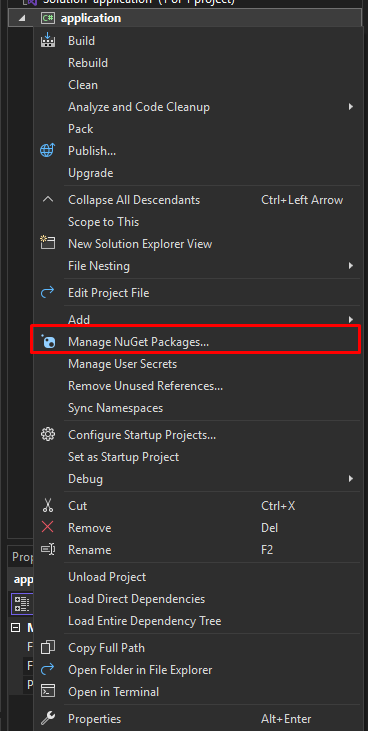
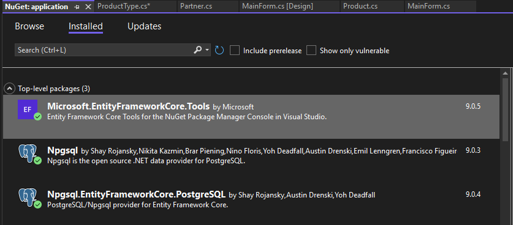

## 🪖 Решение экзамена
### ⚠️ Предупреждение ⚠️
Если вы где-то заметите, что нету 3НФ, я оперался на то, что дает больше всего баллов, типо можете подумать и привести к 3НФ, когда это позволит время, а так как у нас время поджимает ее я делать не буду. Я покажу самый минимальный набор 60+ баллов.
### 🤯 Минимальное количество моделей для выполнения

### 🔮 Что я буду использовать?
- **ASP.NET**
- **WinForms**
- **PostgreSQL**
- **Entity Framework** 

Для выполнения сего крутого задания мы будем использовать [Entity Framework Core 9](https://metanit.com/sharp/efcore/). Покажу как работает алтернативный вариант без создания таблиц в ручную в запроснике.

### Установка зависимостей
1. Кликаем **ПКМ** по нашему проекту → **Manage NuGet Packages**
    ###
    

2. У вас будет другая БДшка, я устанавливаю зависимости для **PostgreSQL**
    - Microsoft.EntityFrameworkCore.Tools
    - Npgsql
    - Npgsql.EntityFrameworkCore.PostgreSQL
    ###
    

### Создание моделей 
